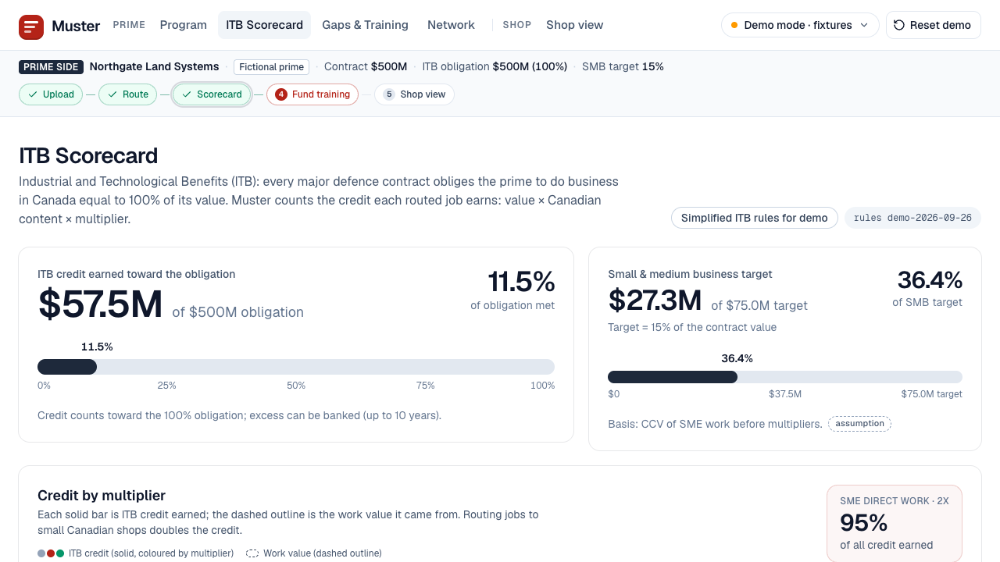
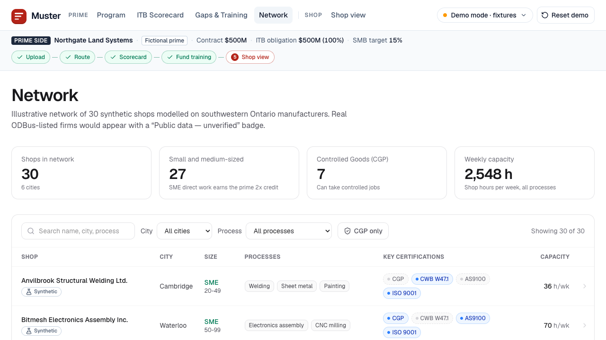

# Muster

**Muster turns defence contracts into work and workers for small Canadian factories.**

Built for AF Hacks "Growing Canada" (University of Waterloo, September 2026).
*Simplified ITB rules for demo · Public data unverified · Not affiliated.*


## The problem

- **Money is arriving.** Budget 2025 commits **$81.8B more to defence over five years**, and the February 2026 Defence Industrial Strategy targets 70% of defence acquisitions going to Canadian firms by 2035 ([Budget 2025 ch. 4](https://budget.canada.ca/2025/report-rapport/chap4-en.html), [DIS](https://www.canada.ca/en/department-national-defence/corporate/reports-publications/industrial-strategy/security-sovereignty-prosperity.html)).
- **Primes owe Canada the full contract value.** Under the Industrial and Technological Benefits (ITB) Policy, a prime must do business in Canada equal to **100% of the contract value**, with 2x credit for direct small-business work and 5x for eligible skills and training ([ISED ITB overview](https://ised-isde.canada.ca/site/ised/en/procurement-services/defence-and-marine-procurement/industrial-and-technological-benefits-itb)). ISED reports **$23.4B of $83.8B** in current obligations as "not identified" (data as of 2025-04-21, [ISED contractor progress](https://ised-isde.canada.ca/site/ised/en/procurement-services/defence-and-marine-procurement/industrial-and-technological-benefits-itb/projects-and-obligations/contractor-progress)).
- **The bottleneck is certified capacity.** Primes can't find qualified small shops, and those shops lack welders qualified to CWB W47.1: 47% of welding employers name a shortage of qualified workers as their most pressing issue ([CWB 2024 survey](https://www.cwbgroup.org/resources/articles/overview-of-the-employment-landscape-in-the-welding-industry)). The gap is CWB-qualified welders at certified shops, not welders in general (see [research notes](docs/research.md#workforce-data)).

## What Muster does

| Module | What it does |
| --- | --- |
| **Route** | A prime uploads a parts list. Muster tags each line, filters shops on hard rules (process, size, certifications, Controlled Goods, CPCSC), scores the rest and assigns each job to a qualified small Canadian shop |
| **Credit** | A live ITB ledger: `credit = value × CCV × multiplier`, direct vs indirect, SMB target progress, % of obligation met |
| **Train** | When no shop can take a job, Muster proposes an ITB-eligible training package. Funding it unblocks the job and earns 5x credit (10x for Indigenous workforce development) |
| **Comply** | Every shop shows its certifications with source, date verified, status and expiry |

**Two-sided.** Primes pay: jobs routed to qualified shops, 2x credit per SME job, a ledger they can report from and a stronger bid. Shops use it free: defence offers they would never have seen, a readiness list of what unlocks more work, and workers trained on the prime's money. A prime's obligation is a shop's opportunity.

| ITB scorecard | Fund training |
| --- | --- |
|  |  |

| Shop side (free for shops) | Network |
| --- | --- |
|  |  |

Screenshots: production build in fixtures mode at 1280×720. Northgate Land Systems is a fictional prime and every shop shown is synthetic.

## Demo walkthrough

The full 4:30 video script, with exact clicks and voiceover, is in [docs/demo-script.md](docs/demo-script.md). In short:

1. **Program** (`/program`): load the fictional Northgate parts list (40 lines, ~$42.7M of work) and route it: **36 assigned, 4 blocked**.
2. **Scorecard** (`/scorecard`): 11.5% of the obligation met; SME work earns 2x.
3. **Gaps & Training** (`/gaps`): four welding jobs are blocked because no available shop has CWB-qualified welders.
4. **Shop view** (`/shops/syn-012`): the shop's readiness card says "Get CWB W47.1 → qualify for 3 more jobs worth $5.1M".
5. **Fund training**: "$96K training → $480K credit (5x) + 3 jobs unblocked (+$9.1M credit)"; the obligation meter moves 11.5% → 13.4%.
6. **Shop view again**: three new offers, "4 welders in training", and the readiness card has moved on to ISO 9001.

## How to run

Requires **Python 3.12** (installed via [uv](https://docs.astral.sh/uv/)) and **Node.js** (for the Next.js web app).

```bash
make setup           # .venv with Python 3.12 via uv + engine deps + web deps
make demo            # production web build, then engine :8000 + web :3000 → http://localhost:3000/program
make dev             # dev servers: engine on :8000 (reload) and web on :3000
make demo-check      # drive the 8-step demo path against the live engine (API_URL=http://localhost:8000)
make fixtures-check  # verify the same 8 steps against data/fixtures (no engine needed)
make test            # engine unit and API tests (pytest)
```

Useful knobs:

- `MUSTER_DB=/path/state.db` puts the engine's SQLite state somewhere other than the default.
- `ANTHROPIC_API_KEY` enables LLM tagging of new parts lists. Without it the tagger uses its cache, then keyword rules; the demo parts list is fully cached.
- `NEXT_PUBLIC_API_URL` and `NEXT_PUBLIC_DEMO_MODE=auto|live|fixtures` configure the web app. At runtime, `?api=<url>` and `?mode=live|fixtures` override them.
- `make reset-demo` (or the header's **Reset demo** button) returns the demo to its empty state.

## Architecture

```
web/  Next.js 16 (React 19, Tailwind, Leaflet, Recharts)
      live mode ── HTTP/JSON ──▶ engine/  FastAPI (Python 3.12)
      fixtures mode ──▶ data/fixtures/*.json (same shapes as the API)
```

**Engine** (`engine/`, contract in [docs/api.md](docs/api.md)):

| Module | Role |
| --- | --- |
| `tagger.py` | Parts-line tagging: explicit CSV columns > cache (`data/cache/`, keyed by a SHA-256 of the line) > LLM (strict JSON) > keyword rules |
| `rules.py` | Hard filters with a readable reason for every failure: process, envelope, certs, controlled → CGP, CPCSC, capacity |
| `scoring.py` | `score = w_fit·fit + w_dist·(1 − d/d_max) + w_lead·(1 − lead/lead_max) + w_itb·itb_norm` (weights in `data/rules/weights.json`) |
| `assign.py` | OR-Tools **CP-SAT** maximizes total score under shop capacity; a **greedy fallback** places the hardest jobs first |
| `graph.py` | In-memory **capability graph** over shops and jobs, so routing and gap queries avoid rescanning every pair |
| `cache.py` | **Revision-keyed response cache**: read-only views are memoized per state revision and invalidated on any write |
| `ledger.py` | ITB credit transactions, direct/indirect split, multiplier breakdown, SMB progress |
| `gaps.py`, `training.py` | Blocked jobs, training suggestions, shop readiness, and the fund simulation (before/after diff) |
| `state.py`, `seed.py` | In-memory demo state persisted to **SQLite**, so the demo survives an engine restart |
| `public.py` | Read-only view of discovered public shops (never routed) |

**Rules as data.** Policy values live in `data/rules/*.json`, each with a `source`; anything not from a policy source is flagged `assumption`.

**Web** (`web/`): Next.js 16 app with a **live** mode (talks to the engine) and a **fixtures** mode (reads `data/fixtures`). A visible badge shows which is active ("Live API" or "Demo mode · fixtures"), and the app falls back to fixtures if the engine is unreachable.

### Repo layout

```
engine/          FastAPI app, routing pipeline, ledger, gaps, tests (engine/tests)
web/             Next.js app (pages: program, scorecard, gaps, network, shops/[id])
data/processed/  cleaned inputs: synthetic + public shops, ODBus candidates, ITB obligations, tenders
data/rules/      policy.json, filters.json, weights.json, training_costs.json (each value sourced or flagged)
data/fixtures/   API responses for every demo step (fixtures mode + make fixtures-check)
data/cache/      tagger cache for the demo parts list
scripts/         ingest_odbus.py, ingest_canadabuys.py, build_fixtures.py, demo_check.py, bench_engine.py
docs/            api.md (contract), demo-script.md, research.md, decisions.md, screenshots/
```

## Data sources and licences

| Source | Used for | Licence / terms |
| --- | --- | --- |
| Statistics Canada, [Open Database of Businesses](https://www150.statcan.gc.ca/n1/pub/21-26-0003/212600032023001-eng.htm) (ODBus v1) | Candidate manufacturers in southwestern Ontario (`data/processed/candidates.csv`) | Open Government Licence – Canada |
| [CanadaBuys open tender data](https://canadabuys.canada.ca/opendata/pub/openTenderNotice-ouvertAvisAppelOffres.csv) | Counts of open defence-related tender notices (`data/processed/tenders_defence*.json`) | Open Government Licence – Canada |
| ISED [ITB pages](https://ised-isde.canada.ca/site/ised/en/procurement-services/defence-and-marine-procurement/industrial-and-technological-benefits-itb) and [model terms](https://ised-isde.canada.ca/site/ised/en/procurement-services/defence-and-marine-procurement/industrial-and-technological-benefits-itb/itb-toolkit/itb-model-terms-and-conditions) | Simplified ITB rules (`data/rules/policy.json`); obligation totals (`data/processed/itb_obligations.json`) | Government of Canada website; facts cited with links |
| Company websites | 78 real public shops: capability facts only (processes, materials, self-declared certifications), a source URL per field, ~1 request/s, no text or images copied | Facts only · **Public data — unverified — not affiliated** |
| Synthetic shops (`data/processed/shops_synthetic.json`) | The 30 shops the demo routes to | Invented; labelled **Synthetic** in data and UI |
| Northgate Land Systems | The demo prime and its parts list | **Fictional** |
| [OpenStreetMap](https://www.openstreetmap.org/copyright) tiles and Nominatim | Map backgrounds; geocoding public shops | © OpenStreetMap contributors, ODbL |

We do not scrape Canada's Business Registries, CADSI GATEWAY or IAQG OASIS. No personal names are stored; contact fields are role-based only.

## Research

[docs/research.md](docs/research.md) holds the sourced, dated and fact-checked research behind the pitch: the policy and news timeline, workforce evidence (for and against a "welder shortage"), training economics compared with our assumptions, the competitive landscape, funding and compliance paths, and a 90-day plan. Design decisions are in [docs/decisions.md](docs/decisions.md).

## Disclaimers

- **Simplified ITB rules for demo · Public data unverified · Not affiliated.** Muster is not affiliated with the Government of Canada, the Defence Investment Agency, ISED, CWB or any company or college named here. Eligibility and credit are decided by the Defence Investment Agency.
- **Training costs are assumptions**, not quotes. The $24K per trainee in the demo is an all-in seat for a *new* welder (tuition, CWB tests, tools and a living stipend); re-qualifying an experienced welder is closer to $2K–$6K. Sources are in `data/rules/training_costs.json` and [research §(c)](docs/research.md#c-training-economics-realistic-costs-compared-with-our-assumptions).
- **No drawings are stored.** Controlled technical data is itself a controlled good, so Muster matches on metadata only.
- **Controlled jobs go only to CGP-registered shops**; that is a hard filter in routing.
- Training partners appear as "example, not affiliated". Real companies are never shown as customers or partners.

## Limitations

- **Simplified ledger.** The ITB rules are reduced to a credit formula and four multipliers. Not yet modelled: the **25% cap on training credit** (model terms §7.5.4.1), the cash-only rule for training credit, the 50% cap on banked credit, Strategic Investment and Canadian Company Boost multipliers, and regional targets.
- **SME definition.** The demo treats under 500 employees as an SME; the official SMB line is ≤250 FTE (≤500 with affiliates).
- **Public shops are not onboarded.** The 78 real shops are listed for coverage only: unverified, never routed, and none has claimed a profile. The demo routes to synthetic shops.
- **ODBus coverage is uneven.** It only includes municipalities that publish business open data. Waterloo, Cambridge, Woolwich and London have no municipal feed in ODBus v1, so all 115 ODBus candidates come from Kitchener (103) and Hamilton (12).
- **Certifications are declared, not verified**, for public shops; CPCSC is always shop-declared.
- **Single tenant, no accounts.** One program, one demo state, local SQLite.

## Next steps

From the startup plan (CLAUDE.md §9) and the [90-day plan](docs/research.md#90-day-plan-gate-3-primes-say-wed-pilot-15-shop-interviews-dia-itb-team-has-reviewed-the-concept):

1. **Discover (weeks 1–4):** incorporate, request a concept review from the DIA's ITB team, and run 15 shop interviews through industry associations and regional development offices. Gate: 3 primes or Tier 1s say "we'd pilot".
2. **Pilot (months 2–4):** Route + Credit with one prime's existing suppliers; a pilot LOI and a sample credit report shown to the DIA.
3. **Network (months 4–8):** 50–100 verified shops that claim their profiles; the Train module with one college and one Indigenous-governed institution; CGP registration for Muster.
4. **Expand (months 8–12):** a second prime, the Comply module (expiry alerts, document vault), and European SAFE partners.

Engineering backlog: accounts and multi-tenancy, Postgres in a Canadian region, an ITB engine validated by an ITB consultant (caps, banking, exports), training evidence files, and entity resolution for public shop data.

Business model: primes pay a per-program subscription plus a small fee on routed value; shops and colleges use Muster free.
