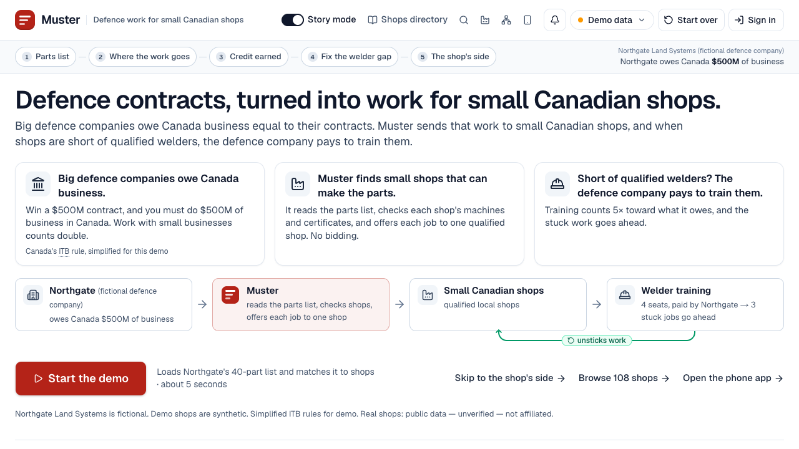
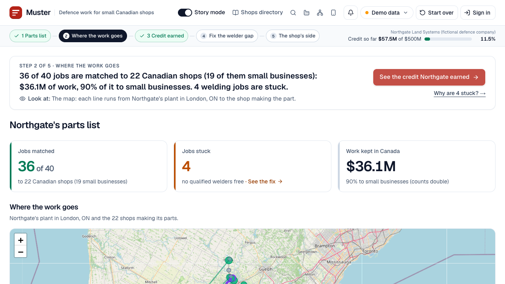
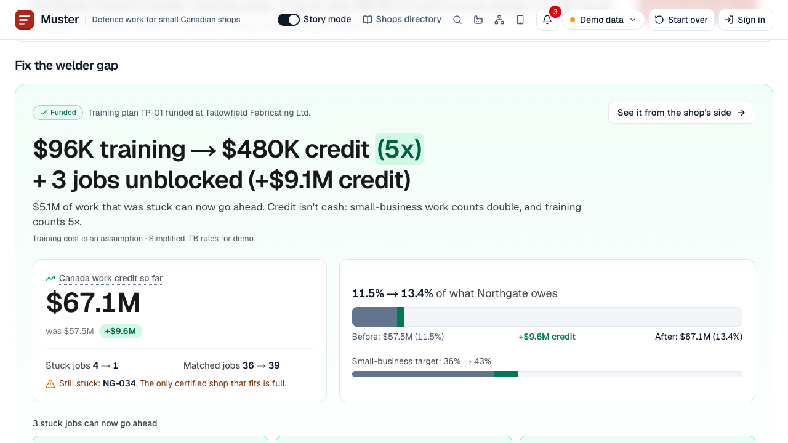
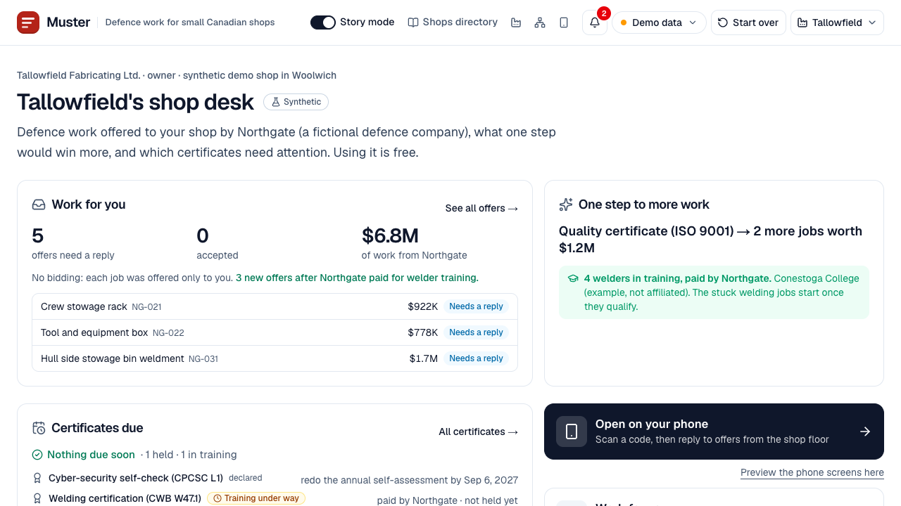
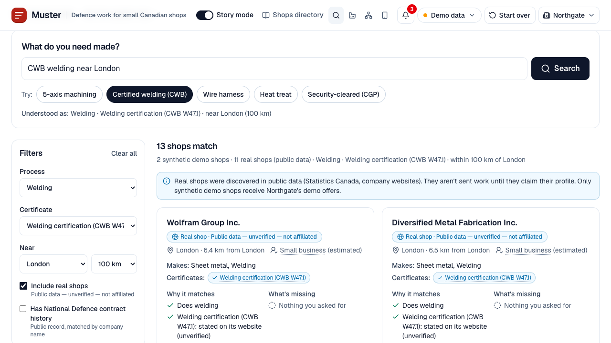
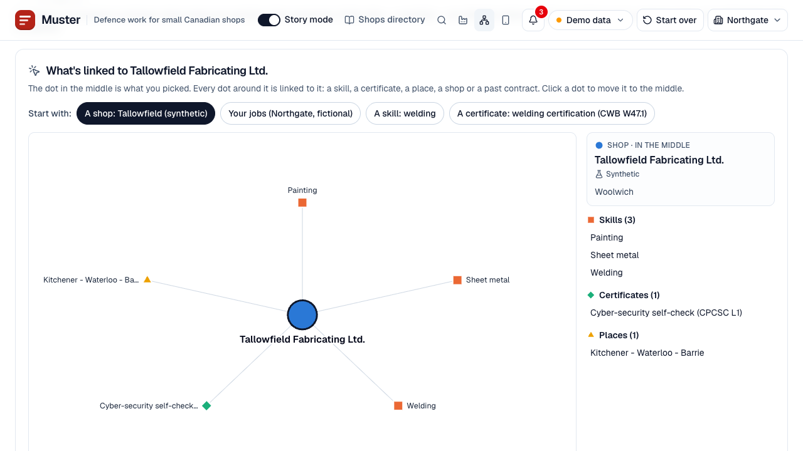
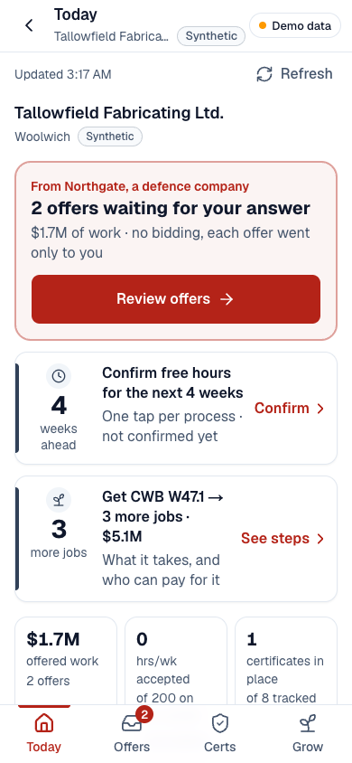
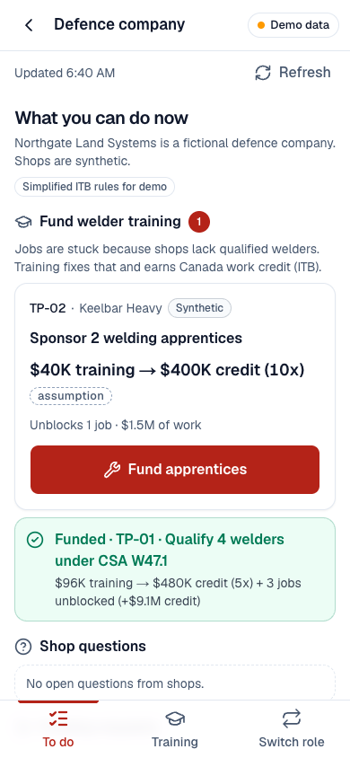

# Shieldworks

**Shieldworks turns defence contracts into work and workers for small Canadian factories.**

Built for AF Hacks "Growing Canada" (University of Waterloo, September 2026).

**Try it out:** [jeojdi1.github.io/AFhacks](https://jeojdi1.github.io/AFhacks/): the full demo in your browser, no install (demo data, runs without the engine). Open it on a phone too: [/m](https://jeojdi1.github.io/AFhacks/m/). The 2-minute path is in [docs/demo-2min.md](docs/demo-2min.md). **Code:** this repo; to run the live engine locally see [How to run](#how-to-run).
*Simplified ITB rules for demo · Public data unverified · Not affiliated.*



## The problem

- **Money is arriving.** Budget 2025 commits **$81.8B more to defence over five years**, and the February 2026 Defence Industrial Strategy targets 70% of defence acquisitions going to Canadian firms by 2035 ([Budget 2025 ch. 4](https://budget.canada.ca/2025/report-rapport/chap4-en.html), [DIS](https://www.canada.ca/en/department-national-defence/corporate/reports-publications/industrial-strategy/security-sovereignty-prosperity.html)).
- **Defence companies owe Canada the full contract value.** Under the Industrial and Technological Benefits (ITB) Policy, a prime must do business in Canada equal to **100% of the contract value**, with 2x credit for direct small-business work, 5x for eligible skills and training and 10x for Indigenous workforce development ([ISED ITB overview](https://ised-isde.canada.ca/site/ised/en/procurement-services/defence-and-marine-procurement/industrial-and-technological-benefits-itb)). ISED reports **$23.4B of $83.8B** in current obligations as "not identified" (data as of 2025-04-21, [ISED contractor progress](https://ised-isde.canada.ca/site/ised/en/procurement-services/defence-and-marine-procurement/industrial-and-technological-benefits-itb/projects-and-obligations/contractor-progress)).
- **The work is spread thin.** National Defence reported **58,965 contracts worth $82.9B** to **16,097 vendors** from January 2021 to June 2026; Ontario vendors hold **34% of the value going to vendors in Canada** (31% of all value) ([proactive disclosure, contracts over $10K](https://open.canada.ca/data/en/dataset/d8f85d91-7dec-4fd1-8055-483b77225d8b); our de-duplicated count, `data/processed/national/dnd_contracts_summary.json`).
- **The bottleneck is certified capacity.** Primes can't find qualified small shops, and those shops lack welders qualified to CWB W47.1: 47% of welding employers name a shortage of qualified workers as their most pressing issue ([CWB 2024 survey](https://www.cwbgroup.org/resources/articles/overview-of-the-employment-landscape-in-the-welding-industry)). The gap is CWB-qualified welders at certified shops, not welders in general (see [research notes](docs/research.md#workforce-data)).

## What Shieldworks does

Shieldworks reads a defence company's parts list, offers each job to one qualified small Canadian shop (no bidding), counts the ITB credit it earns, and, when no shop has the certified welders, proposes training the defence company can fund. Training earns 5x credit and unblocks the stuck work.

| Module | What it does |
| --- | --- |
| **Route** | Tags each parts line (Claude, cached), filters shops on hard rules (process, size, certifications, Controlled Goods, CPCSC, capacity), scores the rest and assigns each job with a CP-SAT optimizer |
| **Credit** | A live ITB ledger: `credit = value × Canadian content × multiplier` (regular 1x, small-business 2x, training 5x, Indigenous workforce 10x), direct vs indirect, small-business target, % of obligation met |
| **Train** | Blocked jobs become training packages. Funding one adds a pending-training certification and welding hours, re-routes, unblocks the jobs and books the training credit |
| **Comply** | Every certification shows its source, date checked, status, expiry and the act-by date for renewal |

**Four roles, one engine.** Each side of a defence contract has its own desk, on the laptop and on the phone:

| Role (demo account) | Laptop | Phone |
| --- | --- | --- |
| **Defence company**: Northgate Land Systems (*fictional*) | `/prime` Northgate's desk, `/prime/suppliers` Find suppliers, `/graph` Supplier map, plus the story pages | `/m/prime`: fund training, shop questions, accepts and declines, certificates that put credit at risk |
| **Supplier**: Tallowfield Fabricating (`syn-012`, *synthetic*) | `/shop` shop desk, `/shop/work` Find work (offers, near misses, open federal tenders) | `/m/shops/syn-012`: Today, Offers (accept / decline / ask), Certs, Grow ("Ask Northgate to fund this") |
| **Training partner**: regional college (*example, not affiliated*) | `/college` training coordinator | `/m/college` |
| **Trainee**: Seat 3 of 4 (*pseudonymous*) | `/trainee` training seat | `/m/trainee/TP-01?seat=3` |

**Two-sided.** Defence companies pay: jobs routed to qualified shops, 2x credit per small-business job, a ledger they can report from. Shops use it free: defence offers they would never have seen, a readiness list of what unlocks more work, and welders trained on the defence company's money. A prime's obligation is a shop's opportunity.

## Demo walkthrough

The full ≤ 5:00 video script, with exact clicks and voiceover, is in [docs/demo-script.md](docs/demo-script.md). The story bar on the laptop numbers the steps:

1. **Parts list** (`/program`): load Northgate's parts list: 40 parts, $42.7M of work, 5 controlled.
2. **Where the work goes**: **36 of 40 jobs matched** to 22 Canadian shops, $36.1M of work, 90% to small businesses; **4 welding jobs stuck**. Controlled parts go only to Controlled Goods-registered shops.
3. **Credit earned** (`/scorecard`): **$57.5M of $500M (11.5%)**; small-business work counts double.
4. **Fix the welder gap** (`/gaps`): four welder training seats at Tallowfield. **Fund training**: "**$96K training → $480K credit (5x) + 3 jobs unblocked (+$9.1M credit)**"; the meter moves **11.5% → 13.4%**.
5. **The shop's side** (`/shops/syn-012`, then the phone): before funding, "Get CWB W47.1 → qualify for 3 more jobs worth $5.1M"; on the phone the shop accepts one offer, declines one with a reason, asks Northgate to fund W47.1, and after funding sees 3 new offers and 4 welders in training.

| Where the work goes | Fund training |
| --- | --- |
|  |  |

| Shop desk (Tallowfield, synthetic) | Find suppliers |
| --- | --- |
|  |  |

| Supplier map | Phone: supplier Today | Phone: defence company |
| --- | --- | --- |
|  |  |  |

Screenshots (re-captured 2026-09-27 by clicking through the whole demo script: load, match, the phone accepts NG-021 and declines NG-022, asks for funding, Fund training, then both sign-ins): production build in fixtures mode ("Demo data"), laptop at 1280×720 and phone at 390×844. The phone Today shot is before funding; the shop desk, search, map and Northgate phone shots are after. Northgate Land Systems is fictional, Tallowfield and every routed shop are synthetic, and real shops appear only as "Public data — unverified — not affiliated". The search screenshot shows the in-memory graph; with Neo4j loaded the badge reads "Powered by Neo4j" and the results are the same (13 shops after funding, checked live).

## Portals, phone and simulation

- **Landing and sign-in.** `/` explains Shieldworks in three panels and starts the guided demo. `/signin` ("Who are you today?") offers the four role cards. **Demo sign-in only: fictional accounts, no real authentication**; the choice stays in the browser.
- **Phone app over Wi-Fi.** `make demo` builds the web app with a same-origin `/engine` proxy and prints the phone URL (`http://<laptop IP>:3000/m`). `/phone` on the laptop shows a QR code for it. A phone on the same Wi-Fi then shares the laptop's engine: a shop's accept on the phone shows up as a toast on the laptop within seconds. `/m` is a four-role picker.
- **Supplier search** (`/prime/suppliers`). Plain-language queries ("CWB welding near London", "welding near London with past defence contracts") become process, certificate, distance and National Defence-history filters over the capability graph: one Cypher query on **Neo4j** when it is running and loaded, the same answer from the in-memory graph otherwise. The **Supplier map** (`/graph`) walks the same graph node by node.
- **Simulation.** `make demo-seed` (or **Fill with demo activity** on the phone's `/m` picker) loads a routed demo with an hour of simulated shop activity: 4 accepts, a decline, a question, capacity check-ins and a certificate renewal. **Simulate shops responding** plays one more scripted event every 8 s. Simulated events are labelled; Tallowfield's offers and the TP-01 fund moment are never touched, so the demo numbers stay the same ([docs/api.md §8](docs/api.md#8-demo-seed-and-simulation-additive-v04)).

## How to run

Requires **Python 3.12** (installed via [uv](https://docs.astral.sh/uv/)) and **Node.js** (Next.js web app). Neo4j is optional.

```bash
make setup           # .venv with Python 3.12 via uv + engine deps + web deps
make demo            # production web build (same-origin /engine proxy), engine :8000 + web :3000; prints the phone URL
make demo-seed       # optional: fill the running demo with simulated shop activity (POST /demo/seed?scenario=populated)
make reset-demo      # back to the empty state (the header's "Start over" does the same)
make graph-up        # optional: start Neo4j, wait for it, load the graph if stale (make graph-load forces a reload)
make dev             # dev servers: engine on :8000 (reload) and web on :3000
make demo-check      # drive the 8-step demo path against the live engine (API_URL=http://localhost:8000)
make fixtures-check  # verify the same 8 steps against data/fixtures (no engine needed)
make test            # engine tests (pytest, 419 tests)
```

Useful knobs:

- `MUSTER_DB=/path/state.db` puts the engine's SQLite state somewhere other than the default.
- `NEO4J_URI` / `NEO4J_USER` / `NEO4J_PASSWORD` (environment or `.env`) point at Neo4j; `MUSTER_GRAPH=memory` forces the in-memory graph.
- `ANTHROPIC_API_KEY` enables LLM tagging of new parts lists. Without it the tagger uses its cache, then keyword rules; the demo parts list is fully cached.
- `NEXT_PUBLIC_API_URL` and `NEXT_PUBLIC_DEMO_MODE=auto|live|fixtures` configure the web app; `MUSTER_ENGINE_URL` is where the `/engine` proxy forwards. At runtime, `?api=<url>` and `?mode=live|fixtures` override them.

## Architecture

```
web/  Next.js 16 (React 19, Tailwind, Leaflet, Recharts)   laptop pages + /m phone app
      live mode ── HTTP/JSON (or same-origin /engine proxy) ──▶ engine/  FastAPI (Python 3.12)
      fixtures mode ──▶ data/fixtures/*.json (same shapes as the API)       │
                                                           optional Neo4j ◀─┘ (search + graph; falls back to memory)
```

**Engine** (`engine/`, contract in [docs/api.md](docs/api.md), 29 endpoints; `/docs` serves the OpenAPI UI):

| Module | Role |
| --- | --- |
| `tagger.py` | Parts-line tagging: explicit CSV columns > cache (`data/cache/`, keyed by a SHA-256 of the line) > LLM (strict JSON) > keyword rules |
| `rules.py` | Hard filters with a readable reason for every failure: process, envelope, certs, controlled → CGP, CPCSC, capacity |
| `scoring.py` | `score = w_fit·fit + w_dist·(1 − d/d_max) + w_lead·(1 − lead/lead_max) + w_itb·itb_norm` (weights in `data/rules/weights.json`) |
| `assign.py` | OR-Tools **CP-SAT** maximizes jobs placed, then total score, under shop capacity; a **greedy fallback** places the hardest jobs first |
| `graph.py` | In-memory **capability graph** over shops, processes and certifications, so routing, gaps and search avoid rescanning every pair |
| `pipeline.py` | rules → scoring → assignment → ledger → gaps → training, over the State |
| `ledger.py` | ITB credit transactions, direct/indirect split, multiplier breakdown, small-business progress |
| `gaps.py`, `training.py` | Blocked jobs, training suggestions, shop readiness, and the fund simulation (before/after diff) |
| `shopside.py` | Shop actions from the phone (accept / decline / question, funding requests, capacity check-ins, certificate dates) and the event log the laptop polls |
| `search.py` | Supplier search and job search; Neo4j when available, the in-memory graph otherwise (tests check both give the same answer) |
| `graphdb.py` | The property graph (4,490 nodes, 5,808 edges) and optional Neo4j access; `scripts/load_graph.py` loads it |
| `simulate.py` | Demo seed and the scripted shop-activity queue |
| `cache.py` | **Revision-keyed response cache**: read views are memoized per state revision and invalidated on any write |
| `state.py`, `seed.py` | Demo state persisted to **SQLite**, so the demo survives an engine restart |
| `public.py` | Read-only view of discovered public shops (listed, never routed) |

**Rules as data.** Policy values live in `data/rules/*.json`, each with a `source`; anything not from a policy source is flagged `assumption`.

**Web** (`web/`): a **live** mode (talks to the engine) and a **fixtures** mode (reads `data/fixtures`, works offline). A pill shows which is active ("Live" or "Demo data"), and the app falls back to fixtures if the engine is unreachable.

### Repo layout

```
engine/          FastAPI app, pipeline, ledger, gaps, shop actions, search, graph, simulation, tests
web/             Next.js app: landing, sign-in, story pages, desks, search, supplier map, /m phone app
data/processed/  synthetic + public shops, ITB obligations, tenders; national/ (DND contracts, ODBus, Job Bank, entity links)
data/rules/      policy, filters, weights, training costs, renewals, readiness steps (each value sourced or flagged)
data/fixtures/   API responses for every demo step (fixtures mode, make fixtures-check), plus app/ and search/ examples
data/cache/      tagger cache for the demo parts list
scripts/         ingest_*.py, link_entities.py, load_graph.py, build_*fixtures.py, demo_check.py, bench_engine.py
docs/            api.md (contract), demo-script.md, devpost.md, pitch.md, research.md, decisions.md, screenshots/
```

## Real public data (honestly labelled)

The demo routes only to synthetic shops. Real public data sits beside it for search and context, never as customers or partners:

| What | Size | Where it shows |
| --- | --- | --- |
| National Defence contracts over $10K, 2021-01 to 2026-06 | 58,965 contracts, $82.9B, 16,097 vendors | DND contract history on search results and the supplier map (name matches, unverified) |
| StatCan ODBus manufacturers (NAICS 331–336) | 2,946 sites (ON 2,653, BC 240, AB 53) | Supplier map; 59 name-match a DND vendor |
| Real shops discovered from company websites + ODBus | 78 shops in 12 southwestern Ontario cities (39 list welding) | Shops directory and search, "Public data — unverified — not affiliated", never routed |
| CanadaBuys open tender notices (sample of 2026-09-26) | 919 open notices, 376 defence-related | Find work: open federal tenders a shop could bid on |
| Job Bank 2025–2027 outlooks + StatCan job vacancies | 12 trades by region | Supplier map (hiring outlook) |
| Capability graph (Neo4j or memory) | 4,490 nodes, 5,808 edges: 108 shops, 2,946 ODBus manufacturers, 1,099 DND vendors, 40 Northgate jobs, 53 primes / 123 programs from ISED's ITB report, 89 regions, 12 trades | Search and supplier map (`GET /graph/summary`) |

## Data sources and licences

| Source | Used for | Licence / terms |
| --- | --- | --- |
| Statistics Canada, [Open Database of Businesses](https://www150.statcan.gc.ca/n1/pub/21-26-0003/212600032023001-eng.htm) (ODBus v1) | Manufacturers (`national/odbus_manufacturers.csv`); the original southwestern Ontario candidates (`candidates.csv`) | Open Government Licence – Canada |
| [National Defence contracts over $10K](https://open.canada.ca/data/en/dataset/d8f85d91-7dec-4fd1-8055-483b77225d8b) (proactive disclosure) | Contract counts and vendor history (`national/dnd_contracts_summary.json`, `dnd_contract_vendors.json`) | Open Government Licence – Canada |
| [CanadaBuys open tender data](https://canadabuys.canada.ca/opendata/pub/openTenderNotice-ouvertAvisAppelOffres.csv) | Open defence-related tender notices (`tenders_defence*.json`) | Open Government Licence – Canada |
| ESDC [Job Bank outlooks and wages](https://open.canada.ca/data/en/dataset/b0e112e9-cf53-4e79-8838-23cd98debe5b) | Trade outlooks by region (`national/labour_outlook*.json`) | Open Government Licence – Canada |
| Statistics Canada [job vacancies (14-10-0444)](https://www150.statcan.gc.ca/t1/tbl1/en/tv.action?pid=1410044401) | Welder vacancies, Ontario (`national/job_vacancies.json`) | Statistics Canada Open Licence |
| ISED [ITB pages](https://ised-isde.canada.ca/site/ised/en/procurement-services/defence-and-marine-procurement/industrial-and-technological-benefits-itb) and [model terms](https://ised-isde.canada.ca/site/ised/en/procurement-services/defence-and-marine-procurement/industrial-and-technological-benefits-itb/itb-toolkit/itb-model-terms-and-conditions) | Simplified ITB rules (`data/rules/policy.json`); obligation totals (`itb_obligations.json`) | Government of Canada website terms and conditions (not the OGL); facts cited with links |
| Company websites | 78 real public shops: capability facts only (processes, materials, self-declared certifications), a source URL per field, ~1 request/s, no text or images copied | Facts only · **Public data — unverified — not affiliated** |
| Synthetic shops (`shops_synthetic.json`) | The 30 shops the demo routes to | Invented; labelled **Synthetic** in data and UI |
| Northgate Land Systems | The demo defence company and its parts list | **Fictional** |
| [OpenStreetMap](https://www.openstreetmap.org/copyright) tiles and Nominatim | Map backgrounds; geocoding public shops | © OpenStreetMap contributors, ODbL |

We do not scrape Canada's Business Registries, CADSI GATEWAY or IAQG OASIS. No personal names are stored (person-like vendor names are dropped from the DND data); contact fields are role-based only. DND matches are company-name matches, not confirmed by the companies.

## Research

[docs/research.md](docs/research.md) holds the sourced, dated and fact-checked research behind the pitch: the policy and news timeline, workforce evidence (for and against a "welder shortage"), training economics compared with our assumptions, the competitive landscape, funding and compliance paths, and a 90-day plan. Design decisions are in [docs/decisions.md](docs/decisions.md).

## Disclaimers

- **Simplified ITB rules for demo · Public data unverified · Not affiliated.** Shieldworks is not affiliated with the Government of Canada, the Defence Investment Agency, ISED, CWB or any company or college named here. Eligibility and credit are decided by the Defence Investment Agency.
- **Northgate Land Systems is fictional**, demo shops are **synthetic**, training partners are **examples, not affiliated**, and the trainee is a pseudonymous seat. Real companies are never shown as customers or partners.
- **Training costs are assumptions**, not quotes. The $24K per trainee is an all-in seat for a *new* welder (tuition, CWB tests, tools and a living stipend); re-qualifying an experienced welder is closer to $2K–$6K. Sources are in `data/rules/training_costs.json` and [research §(c)](docs/research.md#c-training-economics-realistic-costs-compared-with-our-assumptions).
- **No drawings are stored.** Controlled technical data is itself a controlled good, so Shieldworks matches on metadata only. **Controlled jobs go only to CGP-registered shops**; that is a hard filter in routing.

## Limitations

- **Simplified ledger.** The ITB rules are reduced to a credit formula and four multipliers. **The 25% cap on training credit (model terms §7.5.4.1) is not modelled in the ledger** (the Fund screen only states the cap and the plan's share of it: $480K is 0.4% of $125M), nor are the cash-only rule for training credit, the 50% cap on banked credit, Strategic Investment and Canadian Company Boost multipliers, or regional targets.
- **Demo sign-in is not real authentication.** The four accounts are fictional, anyone can pick any role, and there is one shared demo state (single tenant, local SQLite).
- **Public shops are not onboarded.** The 78 real shops are listed for coverage only: unverified, never routed, and none has claimed a profile. Their certifications are self-declared on their websites; CPCSC is always shop-declared.
- **ODBus coverage is uneven.** It only includes municipalities that publish business open data: 2,946 manufacturers in Ontario, British Columbia and Alberta, none in other provinces, and none from Waterloo, Cambridge, Woolwich or London.
- **DND history is a name match**, not a confirmed link, and the CanadaBuys tenders are a one-day sample.
- **SME definition.** The demo treats under 500 employees as an SME; the official SMB line is ≤250 FTE (≤500 with affiliates).
- **Simulation is scripted.** Seeded and simulated shop replies are labelled and come from a fixed queue, not real shops.

## Next steps

From the startup plan (CLAUDE.md §9) and the [90-day plan](docs/research.md#90-day-plan-gate-3-primes-say-wed-pilot-15-shop-interviews-dia-itb-team-has-reviewed-the-concept):

1. **Discover (weeks 1–4):** incorporate, request a concept review from the DIA's ITB team, and run 15 shop interviews through industry associations and regional development offices. Gate: 3 primes or Tier 1s say "we'd pilot". We have emailed 55 organisations so far.
2. **Pilot (months 2–4):** Route + Credit with one prime's existing suppliers; a pilot LOI and a sample credit report shown to the DIA.
3. **Network (months 4–8):** 50–100 verified shops that claim their profiles; the Train module with one college and one Indigenous-governed institution; CGP registration for Shieldworks.
4. **Expand (months 8–12):** a second prime, the Comply module (expiry alerts, document vault), and European SAFE partners.

Engineering backlog: real accounts and multi-tenancy, Postgres in a Canadian region, an ITB engine validated by an ITB consultant (training cap, banking, exports), training evidence files, and entity resolution for public shop data.

Business model: defence companies pay a per-program subscription plus a small fee on routed value; shops and colleges use Shieldworks free.
